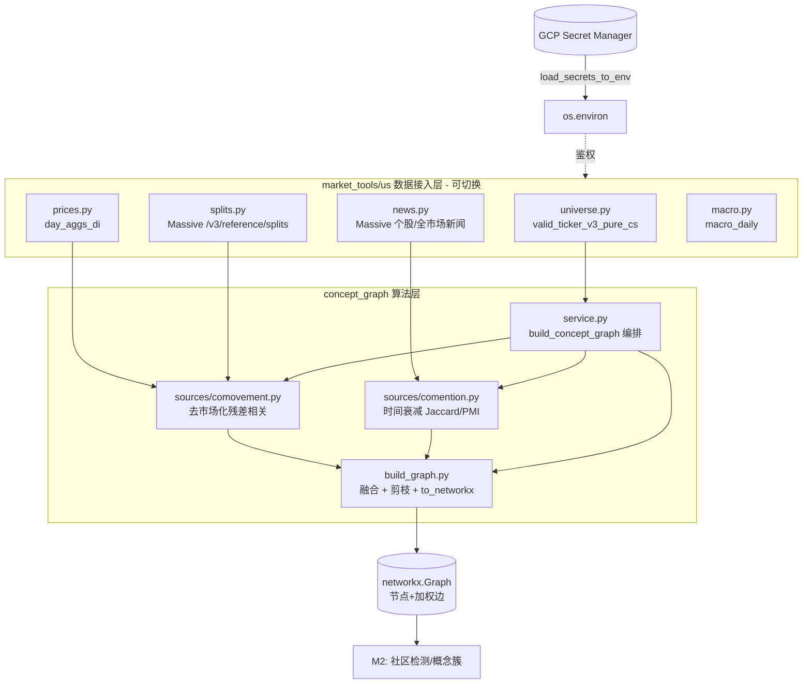

# 概念图谱 M1 交付文档（供审阅）

> 范围：M1 = G0（拆股修正）+ G1（co-movement 边）+ G2（co-mention 边）+ G3（融合/剪枝/建图），并提前交付了端到端编排入口 `service.py`（原 G7 的 service 接口部分）。
> 目标：从「数据」端到端产出一张**以个股为节点、以「关联强度」为加权边**的无向关系图（`networkx.Graph`），供 M2 的社区检测切分概念簇。
> 状态：已实现并用真实数据跑通；13 个单测通过。社区检测/命名/持久化属于 M2/M3，不在本里程碑。

---

## 1. M1 成果一览

| 能力 | 状态 | 证据 |
|---|---|---|
| 凭证经 Secret Manager 注入（本地零存储） | ✅ | ADC 实测，Massive/FMP/BQ 实时调用通过 |
| 市场化、可切换的数据接入层 `market_tools/us` | ✅ | `get_market_tools("US")` 满足 `MarketDataTools` 契约（`isinstance` 实测 True） |
| 拆股修正（co-movement 前置） | ✅ | `BN` 3:2 拆股日收益 −36.24% → −4.36% |
| co-movement 去市场化残差相关边 | ✅ | 23 票子集出现能源/半导体/银行/大科技等合理簇结构 |
| co-mention 时间衰减共现边 | ✅ | 实时新闻 40 篇中 29 篇 ≥2 ticker，可建边 |
| 边融合 + 剪枝 + networkx 建图 | ✅ | 端到端 23 节点 / 67 边 |
| 端到端编排 `build_concept_graph()` | ✅ | 一行产出 `(edges_df, nx.Graph)` |

---

## 2. 总体架构与数据流



**关键分层原则**：算法层（`concept_graph`）只消费 `DataFrame`，不直接接触任何 vendor/BQ；所有取数都在 `market_tools/us`。因此「换市场 = 换 `market_tools/<mkt>/` 实现」，算法与编排完全复用。

---

## 3. 模块清单

### 3.1 数据接入层 `tradingagents/market_tools/`

| 文件 | 职责 | 关键接口 |
|---|---|---|
| `__init__.py` | 市场无关契约 + 解析器 | `MarketDataTools`(Protocol)、`get_market_tools(market)` |
| `us/_bigquery.py` | BQ 公共 helper（ADC 鉴权、表常量） | `run_query()`、`fq()` |
| `us/universe.py` | 候选股票池 | `load_candidate_universe(min_avg_volume, min_avg_price, ticker_type)` |
| `us/prices.py` | 日线 / 分钟价格（非复权） | `load_daily_close()`、`load_minute_close()` |
| `us/splits.py` | 拆股事件 | `load_splits(tickers, start, end)` |
| `us/macro.py` | 宏观结构化 + LLM 摘要 | `load_macro_daily()`、`get_macro_summary()` |
| `us/news.py` | 新闻 facade（委托 Massive/FMP） | `load_news_articles()`、`get_stock_news()`、`get_market_news()`、`get_economic_calendar()` |

> 凭证：`tradingagents/dataflows/secrets.py` 的 `load_secrets_to_env()` 启动时从 Secret Manager 注入 env（`MASSIVE_API_KEY`/`FMP_API_KEY`/`GOOGLE_API_KEY`/…）；vendor 模块仍只读 env，key 仅在内存。
> HTTP/解析底座：`dataflows/massive.py`（`fetch_news_articles`/`fetch_splits`/`get_news`）与 `dataflows/fmp.py`，已注册到框架 vendor router，被新闻 facade 复用，不重复造轮子。

### 3.2 算法层 `tradingagents/concept_graph/`

| 文件 | 职责 |
|---|---|
| `config.py` | `GraphConfig` 全部可调参数（单一事实源） |
| `sources/comovement.py` | 收益率计算（含拆股修正）→ 去市场化 → 残差相关 → co-movement 边 |
| `sources/comention.py` | 新闻共现 → 时间衰减 → Jaccard/PMI → co-mention 边 |
| `build_graph.py` | 两类边归一融合 → 剪枝 → `to_networkx` |
| `service.py` | `build_concept_graph()` 端到端编排 |

---

## 4. 原理详解

### 4.1 co-movement 边（价格协同）

**动机**：原始日收益率相关在牛市里被「市场公因子」主导——几乎所有股票都同涨，相关性虚高，社区检测会退化成一个大簇。必须**剥离市场因子**，只保留个股相对市场的「超额协同」。

**步骤（`sources/comovement.py`）**：

1. **拆股修正（前置必做）**。BQ 日线是**非复权**的，一次拆股会在执行日制造 ~−90% 的幻象收益，摧毁该股相关性。用 Massive 拆股事件在执行日按比例还原：

```
factor      = split_to / split_from
adj_return_t = (1 + raw_return_t) · factor − 1     # 仅拆股执行日
```

   实测：`BN` 3:2 拆股（split_from=2, split_to=3, factor=1.5），原始 −36.24% → `(1−0.3624)×1.5−1 = −4.36%`。

2. **去市场化（demarket）**。对每只票，在窗口内对市场代理（默认 `SPY`，存在于 `day_aggs_di`）做回归，取残差：

```
r_i,t = α_i + β_i · r_mkt,t + ε_i,t
```

   只移除斜率项 `β_i · r_mkt`（截距 α 对相关无影响，故省略）。残差 `ε_i` 即「去掉大盘后的个股独立波动」。

3. **稳健化 + 相关**。对残差做 winsorize（默认 1%/99% 分位裁尾）抵御脏点，再算残差两两相关（默认 Pearson，可切 Spearman）。默认只保留正相关边（`keep_positive_only`）。

   产物：长表 `[src, dst, comovement]`（`src < dst`，无向）。

> 实测对照（NFLX 10:1 拆股落入窗口时）：未修正 NFLX–GOOGL 相关 −0.048（错误负相关），修正后 +0.028，重新归入大科技簇。

### 4.2 co-mention 边（新闻共现）

**动机**：同一篇新闻里被一起提到的两只票，存在弱关联；跨窗口累积即构成共现图。但需解决两类偏差。

**步骤（`sources/comention.py`）**：

1. **严格无未来函数**：只用 `(cutoff, as_of]` 窗口内的文章（默认回溯 90 个日历天）。
2. **时间衰减**：每篇文章按 `w = exp(-λ · age_days)`（默认 λ=0.02）加权，越新权重越高。
3. **过滤噪音**：单 ticker 文章不成边；「涨幅榜」式一次性罗列大量 ticker 的文章（>15 个）直接丢弃，避免制造虚假共现。
4. **归一化**（消除大盘股「哪都出现」的偏差）：
   - 默认 **Jaccard**：`score = n_ij / (n_i + n_j − n_ij)`（均为衰减加权计数）
   - 可选 **PMI**：`log( p_ij / (p_i·p_j) )`，只保留正值
5. 共现文章数需 ≥ `comention_min_articles`（默认 2）才成边。

   产物：长表 `[src, dst, comention]`（`src < dst`）。

### 4.3 边融合与剪枝（`build_graph.py`）

1. **归一**：两类边各自 minmax（或 rank）归一到 [0,1]。
2. **加权融合**（在 `(src,dst)` 上 outer-merge，缺失填 0）：

```
weight = fuse_alpha · comention_n + fuse_beta · comovement_n
```

   默认 `alpha=0.4`（共现）、`beta=0.5`（协同）；`gamma`（ETF 共同归属，P2）暂未启用。
3. **节点域约束**：`node_universe`（候选池 CS 票）只保留两端都在池内的边，自动剔除 SPY/QQQ 等代理节点。
4. **剪枝**：先按 `prune_min_weight`（默认 0.1）截断弱边；再做 **每节点 top-K 的 KNN 稀疏化**（默认 K=20，「任一端点的 top-K」即保留），让图稀疏到适合社区检测。
5. `to_networkx(edges)` → 无向加权 `networkx.Graph`，边属性含 `weight/comovement/comention`。

### 4.4 端到端编排（`service.py`）

```python
def build_concept_graph(as_of_date, universe=None, config=None,
                        market="US", splits=None, max_news_articles=20000):
    # 1. tools = get_market_tools(market)
    # 2. universe 缺省 → load_candidate_universe()
    # 3. 价格窗口 = as_of - (comovement_window*2 + 10) 日历天（保证够 N 个交易日）
    #    load_daily_close(universe + market_ticker)
    # 4. splits 缺省 → 自动 load_splits 窗口内；splits=False 关闭
    # 5. build_comovement_edges + build_comention_edges
    # 6. fuse_and_prune(node_universe=universe) → to_networkx
    # return (edges_df, nx.Graph)
```

- `splits` 三态：`None`=自动加载窗口内拆股；`False`=不修正；传 `DataFrame`=外部覆盖。
- 新闻窗口 = `as_of - comention_window_days`。

---

## 5. 配置参数 `GraphConfig`

| 参数 | 默认 | 含义 |
|---|---|---|
| `market_ticker` | `SPY` | 去市场化基准（在 day_aggs_di 内） |
| `comovement_window` | 120 | co-movement 回溯**交易日**数 |
| `comovement_min_periods` | 40 | 成边所需最少重叠交易日 |
| `comovement_method` | `pearson` | 残差相关法（可 `spearman`） |
| `winsorize_quantile` | 0.01 | 残差裁尾分位（`None` 关闭） |
| `keep_positive_only` | `True` | 仅保留正相关边 |
| `comention_window_days` | 90 | co-mention 回溯**日历天** |
| `comention_decay_lambda` | 0.02 | 时间衰减系数 |
| `comention_max_tickers_per_article` | 15 | 超过则视为榜单噪音丢弃 |
| `comention_method` | `jaccard` | 共现归一（可 `pmi`） |
| `comention_min_articles` | 2 | 成边所需最少共现文章数 |
| `fuse_alpha / fuse_beta / fuse_gamma` | 0.4 / 0.5 / 0.1 | 融合权重（共现/协同/ETF；γ 暂未用） |
| `normalize_method` | `minmax` | 边归一法（可 `rank`） |
| `prune_min_weight` | 0.1 | 弱边截断阈值 |
| `prune_top_k` | 20 | 每节点保留 top-K 邻居（`None` 关闭） |

---

## 6. 测试与实测证据

**单元测试（mock HTTP / 合成数据，`pytest` 13 passed）**：
- `test_concept_graph.py`：co-movement 还原分组结构、拆股修正中和幻象跌、co-mention Jaccard/榜单过滤、融合/剪枝遵守 node_universe 与权重。
- `test_news_vendors.py`：Massive 新闻分页/`max_articles`/sentiment 格式化、FMP 全球新闻/经济日历、`fetch_splits` 分页、`load_splits` 过滤、co-mention 适配器丢弃空 ticker。

**真实数据冒烟（py10 + Secret Manager + 实时 API/BQ）**：
- 候选池 610 只；`macro_daily` 取数+摘要；日线/分钟取数；新闻共现帧。
- 端到端 23 票子集：23 节点 / 67 边，簇结构合理（`CVX–XOM` 能源、`AMD/INTC/MU/AVGO` 半导体、`BAC–JPM` 银行、`KO–PEP` 消费、`AMZN/GOOGL/META/MSFT/NFLX` 大科技、`LLY–PFE` 医药）。
- 拆股修正：`BN` −36.24% → −4.36%；`NFLX` 修正后与大科技相关性恢复。

**过程中修复的真实数据问题（fail-fast，未掩盖 bug）**：
1. `day_aggs_di` 的 `2025-10-16` 整天重复入库 → `SELECT DISTINCT` 去精确重复行（真冲突仍会报错暴露）。
2. Massive `published_utc` 为 tz-aware UTC，与 naive `as_of` 比较冲突 → 在新闻源边界统一为 tz-naive UTC 墙钟。

---

## 7. 已知边界与 M2/M3 待办

- **窗口外拆股不修正**（正确行为）：默认 120 交易日窗口外的拆股不参与，开/关 splits 无差异。
- **分红未修正**：日分红对相关结构影响 <0.5%，M1 忽略；如需 total-return 精度再接 dividends。
- **ETF 共同归属边（γ）**：占位未启用（P2，受历史成分数据限制）。
- **M2**：层次 Leiden 社区检测 + 防膨胀（最小簇/簇数上限/层次截断/跨日稳定性）+ **多重归属**（单票可属多个概念）+ 簇命名（Gemini 结构化输出）+ 持久化 `get_cluster_map()`。
- **M3**：催化剂图传导 `propagate.py`、离线重算脚本 `rebuild_concept_graph.py` + 调度。

---

## 8. 用法

```python
from tradingagents.dataflows.secrets import load_secrets_to_env
from tradingagents.concept_graph import build_concept_graph, GraphConfig

load_secrets_to_env()                      # Secret Manager 注入 key（BQ 用 ADC）

# 默认：候选池全集、自动拆股修正
edges, g = build_concept_graph("2026-06-05")

# 自定义：指定股票池与参数
cfg = GraphConfig(comovement_window=120, prune_top_k=8, comention_method="pmi")
edges, g = build_concept_graph("2026-06-05", universe=["AAPL","MSFT","NVDA"], config=cfg)

# edges: [src, dst, weight, comovement, comention]；g: networkx.Graph（M2 社区检测输入）
```
