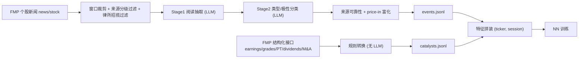

# 事件语料管线（event_corpus）说明

面向下游 NN 的标准化事件语料。核心思路：**不让 LLM 直接预测涨跌方向**（无可靠先例），而是把 LLM 降级到它擅长的事情——把非结构化新闻整理成「标准化、带类型的事件记录」；方向判断交给下游在真实收益上训练的模型。

语料由两条相互独立的数据线组成，最终在 NN 特征拼装时按 `(ticker, session)` 关联：

| 线 | 名称 | 来源 | 是否用 LLM | 产物 |
|---|---|---|---|---|
| 线 2 | 新闻事件 | FMP 个股新闻 | 是（仅做抽取+分类） | `events.jsonl` |
| 线 1 | 结构化催化剂 | FMP 结构化接口 | 否（纯规则） | `catalysts.jsonl` |



---

## 1. 数据源

### 1.1 线 2 — 新闻（FMP `news/stock`）

- 接口：`tradingagents/dataflows/fmp.py::fetch_stock_news`，FMP `stable/news/stock`，按 `symbols + from/to` 拉取，`page` 翻页直至取尽或达上限（每页 250 条）。
- 字段：标题、正文摘要（`text`，**非全文**，是供应商提供的摘要/描述）、发布方、发布时间、URL。
- 时间戳归一：FMP 该接口返回的是**美东时间且无时区标注**，统一转成 RFC3339 UTC（`_news_dt_to_utc`），与下游 price-in 的盘后边界、盘前 cutoff 对齐。
- 默认替换了早期的 Massive 源（Massive 源窄、观点稿多）；仍可用 `--news-source massive` 切回。

### 1.2 线 1 — 结构化催化剂（FMP 结构化接口）

全部为结构化数据，无 LLM、无观点。来源接口（`fmp.py`）：

| 催化剂 | 接口 | 关键字段 |
|---|---|---|
| Earnings 财报 | `fetch_earnings` | `epsActual/epsEstimated`、`revenueActual/Estimated`、`date` |
| AnalystGrade 评级 | `fetch_grades` | `gradingCompany`、`previousGrade→newGrade`、`action` |
| PriceTarget 目标价 | `fetch_price_target_news` | `priceTarget`、`priceWhenPosted`、标题 |
| Dividend 分红 | `fetch_dividends` | `declarationDate`、`dividend`、`frequency`、`yield` |
| MnA 并购 | `fetch_mergers` | 收购方/被收购方代码、`transactionDate`（全市场源，再匹配到 universe） |

> earnings/grades/dividends 单次返回深历史（调用方按日期裁剪）；price-target / mergers 是「最新」流，按页拉取，结果早于 `stop_before` 即停止翻页。

### 1.3 来源可靠性分级（`source_reliability.py`）

每条新闻保留发布方，并据手维护的表分级，用于过滤与确定性判定：

- **HIGH**：一手新闻线 + 顶级财经媒体（Reuters、Bloomberg、WSJ、Dow Jones、AP、FT、Barron's、CNBC、MarketWatch；以及发企业官方稿的 GlobeNewswire / Business Wire / PR Newswire / Accesswire）。
- **MEDIUM**：有编辑标准的主流分析/报道（Zacks、Benzinga、Seeking Alpha、TipRanks、Forbes、Investing.com、Investopedia、TechCrunch、Business Insider 等）。
- **LOW**：观点工厂 / 清单文 / 低信号聚合器（Motley Fool、24/7 Wall Street、GuruFocus、Invezz、Finbold、Stocktwits、Simply Wall St 等）——默认被丢弃。
- **UNKNOWN**：未知发布方。

匹配大小写不敏感，先精确名再子串匹配。

---

## 2. 处理方法

### 2.1 线 2 新闻事件（`extract_events.py` / `events.py`）

**(a) 新闻窗口**（避免跨日重复处理）
- 默认 `incremental`：窗口为 `(上一交易日盘前 cutoff, 本交易日盘前 cutoff]`，每条新闻在一段回填中**只处理一次**，无跨日重复。
- 交易日历由 proxy（默认 SPY）的行情日推导；`lookback` 模式则用固定 N 天窗口（会重叠）。

**(b) 取数与预过滤**（`fetch_ticker_articles`）按顺序：
1. 拉取（带 3× 余量，因后续会过滤掉一部分）；
2. 用精确 UTC `news_start/news_end` 裁剪（FMP 只能按日过滤，需再裁到精确时刻）；
3. 来源分级过滤：默认丢弃 `MEDIUM` 以下（`--min-source-tier`，可选 high/medium/low/all）；
4. **律所集体诉讼招揽稿过滤**（`is_litigation_solicitation`）：一手新闻线上充斥律所发的「lead plaintiff 截止 / 敦促投资者联系」近重复稿，它们会被误判为 Confirmed（因来自 wire）且大量重复，纯噪声，在喂给 LLM 前丢弃；真正的法律报道（DOJ/SEC 指控、庭审）不受影响。

**(c) 两阶段 LLM 抽取**（拆分以提高可靠性，一次性「全判」会退化成默认标签）：
- **Stage 1 阅读**：逐票读原文，输出离散事件，含 `is_primary`（该票是否事件主体）与一句中性 `summary`；纯观点/估值/行情复盘稿被跳过。
- **Stage 2 分类**：对每条 summary 分类 `event_type`（精简类目）+ `polarity`（情绪，非价格判断）。对单行摘要分类远比对噪声原文一致。
- LLM 默认自部署 vLLM + `qwen3-32b`；Qwen thinking 关闭；显式设置 `timeout`/`max_tokens`/`max_retries` 防止单请求挂死或无界生成。

**(d) `certainty` 由规则定，不由 LLM 生成**：一手新闻线（GlobeNewswire/Business Wire/PR Newswire/Accesswire/Newsfile）的稿件 = `Confirmed`，其余（报道/聚合/观点）= `Unconfirmed`。LLM 无法可靠区分「已确认事实」与「报道声称」。

**(e) 非 LLM 富化**：
- `source_reliability`：按发布方打分级；
- `price_in`：**point-in-time** 判定（只用发布前价格、不含未来数据），可在盘前实时算出，作为 NN 的合法输入特征。逻辑：把「发布前 `pre_days` 日位移」**按消息 polarity 方向对齐**、以 ATR 为单位打分——若发布前已朝消息方向大幅移动→信息多半已被 price in；持平或反向→消息可能携带新信息。Neutral/Mixed 无方向，退化为只看位移幅度。三档：`PricedIn`(≥`sig_atr`，默认 1.0) / `Partial`(≥`partial_atr`，默认 0.5) / `NotPricedIn`(其余)，数据不足为 `Unknown`。切分点为「首个可交易 session」(盘后稿顺延到下一 session)，pre 窗口截至其前一收盘，恒为历史数据。
  - `pre_return` / `pre_volume_ratio`：发布前位移与放量，**point-in-time 安全**，可作输入特征。
  - `post_return` / `post_volume_ratio`：reaction session 开盘→`post_days` 日后的位移（**含未来数据**），仅作**回顾性标签**（分析 / 训练 target），**不参与 `price_in` 判定，禁止当输入特征**（否则前视泄漏）。

**(f) 并发 / 断点续跑**：按票线程并发；每票完成即落盘并记进度，中断后重跑同一天会跳过已完成的票（`--no-resume` 可强制重抽）。

### 2.2 线 1 结构化催化剂（`extract_catalysts.py` / `catalysts.py`）

纯规则转换，`certainty` 恒为 `Confirmed`，并**完整保留数值载荷**供 NN 用幅度而非仅类别：

- **Earnings**：`polarity` 由 EPS 实际 vs 预期（±1% 容差）定 beat/miss/inline；保留 eps/revenue 的实际、预期、surprise 与 surprise%。
- **AnalystGrade**：只保留 upgrade/downgrade（maintain 约占 88%、信号低，丢弃）；升=Positive，降=Negative。
- **PriceTarget**：`polarity` 由标题关键词（raised/lowered…）判定；记录目标价、发稿时价、隐含涨幅 `implied_upside`。
- **Dividend**：锚定 `declarationDate`（公开时点）；`polarity` 由相对上一次申报金额的变化（raised/cut/flat）定，按完整历史差分以正确跨越边界。
- **MnA**：全市场流匹配到 universe，按角色拆（acquirer/target），被收购方=Positive、收购方=Neutral，按 `(ticker, acquirer, target, date)` 去重。

---

## 3. 生成结果

### 3.1 `events.jsonl`（线 2，每行一个 `NewsEvent`）

| 字段 | 含义 |
|---|---|
| `ticker` / `as_of_date` | 标的 / 所属交易 session |
| `event_type` | 精简类目：Earnings / Guidance / AnalystAction / MnA / Partnership / Product / Regulatory / Legal / Capital / Governance / Macro / Other |
| `certainty` | `Confirmed` / `Unconfirmed`（按来源规则定） |
| `polarity` | `Positive` / `Negative` / `Neutral` / `Mixed`（情绪，非价格判断） |
| `is_primary` | 该票是否为事件主体 |
| `summary` | LLM 抽出的中性一句话 |
| `source` / `article_url` / `published_utc` / `event_date` | 溯源信息 |
| `source_reliability` | `High` / `Medium` / `Low` / `Unknown`（富化） |
| `price_in` | `PricedIn` / `Partial` / `NotPricedIn` / `Unknown`（point-in-time，仅用发布前价格判定；`PostHoc` 已弃用不再产出） |
| `pre_return` / `pre_volume_ratio` | 发布前位移/放量（point-in-time 安全，可作输入特征） |
| `post_return` / `post_volume_ratio` | 事后位移（含未来数据，仅作回顾性标签，禁止当输入特征） |

### 3.2 `catalysts.jsonl`（线 1，每行一个 `Catalyst`，数值载荷打平到顶层）

公共字段：`ticker`、`catalyst_type`（Earnings/AnalystGrade/PriceTarget/Dividend/MnA）、`effective_date`、`polarity`、`certainty`（恒 Confirmed）、`summary`、`source`（如 `FMP:earnings`）、`published_utc`。

随类型附加的数值字段（节选）：
- Earnings：`eps_actual/estimated/surprise/surprise_pct`、`revenue_actual/estimated/revenue_surprise_pct`
- AnalystGrade：`grading_company`、`previous_grade`、`new_grade`、`action`
- PriceTarget：`analyst_company`、`price_target`、`price_when_posted`、`implied_upside`
- Dividend：`dividend`、`adj_dividend`、`yield`、`frequency`、`change`、`ex_date`、`record_date`、`payment_date`
- MnA：`role`、`acquirer`、`target`、`acquirer_name`、`target_name`、`link`

### 3.3 统计

`scripts/analyze_events.py` 读取已落盘的 `events.jsonl`，输出按 `event_type` / `certainty` / `polarity` / `price_in` / 来源 / 票 的分布与交叉表，用于审核语料质量。

---

## 4. 存储方式

### 4.1 本地（两条线统一为按日期目录）

```
{out_dir}/
  2026-05-01/
    events.jsonl            # 线2：该 session 的新闻事件
    events.progress.json    # 线2：断点续跑进度
    catalysts.jsonl         # 线1：该 effective_date 的结构化催化剂
  2026-05-04/
    ...
```

- `events.jsonl` 按交易 session 落盘；`catalysts.jsonl` 按催化剂自身 `effective_date` 落盘。
- 因此周末/节假日公告（分红、并购）会产生**只有 `catalysts.jsonl`、没有 `events.jsonl`** 的日期目录；交易日通常两者都有。这是数据本身决定的，不强行对齐。

### 4.2 GCS

- 与既有 `concept_graph`、`regime_gate` 并列，本工作统一前缀 **`event_corpus`**：

```
gs://{bucket}/event_corpus/{date}/events.jsonl
gs://{bucket}/event_corpus/{date}/catalysts.jsonl
```

- **非无条件自动**：仅当传入 `--gcs-bucket` 时才上传，且是**运行过程中增量上传**（线 2 每个 session 写完即传；线 1 每个日期写完即传），不设则只写本地。
- 实现见 `tradingagents/regime/gcs.py::upload_events` / `upload_catalysts`，默认前缀 `event_corpus`。

---

## 5. 运行

两条线无依赖，可同时跑（线 1 纯结构化无需 vLLM；线 2 走 vLLM）：

```bash
# 线1：结构化催化剂（无 LLM，可并行）
python scripts/extract_catalysts.py --start 2026-05-01 --end 2026-05-29 \
  --gcs-bucket <bucket> &

# 线2：新闻事件（走 vLLM，按 session 回填、可断点续跑）
python scripts/backfill_events.py --start 2026-05-01 --end 2026-05-29 \
  --gcs-bucket <bucket> &

wait
```

`--gcs-prefix` 默认即 `event_corpus`，无需显式指定。

常用调参（线 2）：
- `--min-source-tier high|medium|low|all`：来源分级阈值（默认 medium）。
- `--max-workers`：LLM 并发；2×3090 跑 qwen3-32b 偏紧，引擎 500/OOM 时降到 1–2。
- `--max-tokens` / `--max-articles-per-ticker`：控制单请求生成长度与单票新闻量。
- `--window incremental|lookback`、`--no-price-in`、`--no-resume`。
- `--retries`（默认 5）/ `--retry-wait`（默认 30s，指数退避封顶 300s）：单 session 失败后自动重跑。因每 session 可断点续跑，重跑只补未完成的票，用于自愈 BQ/vLLM/网络瞬时抖动。`--continue-on-error` 则是重试用尽后仍失败时跳过该 session 继续后续。

---

## 6. 已知限制

- 新闻为供应商**摘要**而非全文；抽取与分类基于摘要。
- price-in 为**日线**粒度，无法看见新闻命中的盘中 tick，前/后以「首个可交易 session」切分。
- 来源分级表为手维护，随 FMP 发布方分布需要时更新。
- 自部署 vLLM 在高并发/长 prompt 下可能 `EngineCore` 500 或**引擎卡死**（多为显存/并发）。卡死时前端 `/v1/models` 仍会响应，故 `--auto-serve` 的 `ensure()` 增加了**生成探针**（发一次 1-token 补全）：探针超时即判定引擎卡死并自动重启，重跑只补未完成的票。降并发与生成长度可减少发生。
- price-in 读 BigQuery 默认走 Storage Read API（gRPC）。本地 TUN/代理把域名映射成假 IP（如 `198.18.x.x`）时 gRPC 不走 HTTP 代理，会间歇 `503 UNAVAILABLE / Socket closed`。`run_query` 已在该异常下自动回退到 REST 路径；也可设 `BQ_USE_STORAGE_API=0` 直接强制 REST。配合 backfill 的 `--retries` 可自愈。
