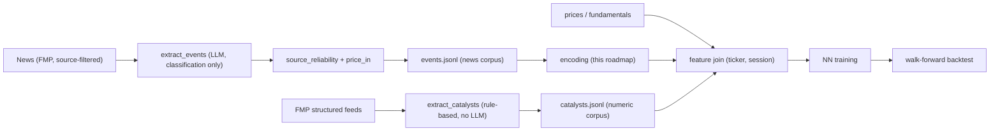

# NN Pipeline Roadmap (events -> encoding -> training)

## Why this exists

Asking an LLM to output a trading **direction** (buy/sell, Long/Short) directly
has no track record of reliability — no frontier model has been shown to do this
natively. So we are repositioning the LLM to the one job it is good at: turning
unstructured news/filings into a **standardized, typed event record**. The
direction call moves out of the LLM and into a downstream model trained on
realized returns.

This document describes the planned (not-yet-built) training stage. The data it
consumes — `events.jsonl` — is produced today by `scripts/extract_events.py`.

## Stage 0 — standardized corpus (DONE)

`NewsEvent` (see `tradingagents/regime/events.py`) per article/ticker, with:
- LLM classification: `event_type`, `certainty`, `polarity`, `materiality`, `horizon`, `summary`.
- provenance: `source`, `article_url`, `published_utc`, `event_date`.
- enrichment: `source_reliability` (publisher tier), `price_in`
  (`NotPricedIn/Partial/PricedIn/PostHoc`), `pre/post_return`, `pre/post_volume_ratio`.

Persisted as JSONL at `regime_gate_output/{as_of}/events.jsonl`.

## Stage 0b — structured catalysts (DONE)

A second, parallel corpus comes straight from FMP's *structured* endpoints — no
LLM, no opinion: earnings (eps/revenue surprise), analyst grade actions
(upgrade/downgrade only), price-target changes, dividends (raise/cut), and M&A.
`scripts/extract_catalysts.py --start --end` writes one `Catalyst` per
(ticker, event), partitioned by effective date to `{out_dir}/<date>/catalysts.jsonl`
(mirroring `events.jsonl`), with `event_type`/`polarity` derived by rule,
`certainty` always Confirmed, and **full numeric payloads preserved** (surprise %,
PT change, dividend amount, implied upside, …).

Both corpora share one GCS prefix, `event_corpus`, so each date holds both files:
`gs://{bucket}/event_corpus/<date>/{events,catalysts}.jsonl`. Upload is automatic
when `--gcs-bucket` is set (events per session, catalysts per date).

These are a different modality from news text and are NOT merged into the
`NewsEvent` schema (that would discard magnitude). Instead the two corpora are
joined at feature-assembly time on (ticker, session): news events are pooled +
embedded, catalysts contribute their numerics directly. Point-in-time visibility
uses each catalyst's `effective_date`/`published_utc`.

## Stage 1 — encoding (planned)

Per event, build a feature vector:
- Categorical one-hot: `event_type`, `certainty`, `polarity`, `materiality`,
  `horizon`, `source_reliability`.
- `summary` -> sentence embedding (local encoder served alongside the vLLM box;
  e.g. a Qwen/BGE embedding model). Keep the embedding model **frozen and
  versioned** so features are reproducible across re-runs.
- price-in features — **point-in-time only**: `pre_return`, `pre_volume_ratio`,
  and the `price_in` label one-hot (now derived purely from the pre-news move,
  so it is safe as an input: `PricedIn` flags an already-anticipated event that
  should carry little forward alpha).
- **Do NOT feed** `post_return` / `post_volume_ratio` as inputs — they use the
  reaction session onward (future data) and overlap the supervised horizon, so
  they are look-ahead leakage. Keep them only as analysis / a candidate target.

Aggregate to a (ticker, session) example by pooling that session's events
(e.g. attention/mean over event vectors), then concatenate point-in-time
market + fundamental features already available via `market_tools`.

## Stage 2 — labels (planned)

Supervised target = forward return over a fixed horizon (1d/3d/5d), measured
from the next tradable open (consistent with `regime/evaluate.py`), optionally
market-neutralized against SPY/QQQ. Leakage guards: features must be strictly
point-in-time (news capped at the pre-market cutoff, fundamentals filtered by
SEC acceptedDate — both already enforced upstream).

## Stage 3 — model + training (planned)

- Start simple (gradient-boosted trees / shallow MLP) as a baseline before any
  sequence model; the event corpus is tabular-ish after pooling.
- Train on the self-hosted GPUs; keep the whole loop offline and cheap so the
  expected many rollback/re-train cycles do not incur API cost.
- Walk-forward validation by date; never shuffle across the time boundary.

## Stage 4 — backtest + feedback (planned)

Feed model scores into the existing whitelist/veto consumption rules and grade
against realized paths with the existing evaluator, closing the loop so source
reliability and event types can eventually be **learned** from outcomes rather
than hand-set.

## Open decisions (defer until Stage 1)

- Embedding model + dimensionality, and whether to fine-tune it.
- Event de-duplication policy across articles describing the same event.
- Pooling architecture for multi-event sessions.
