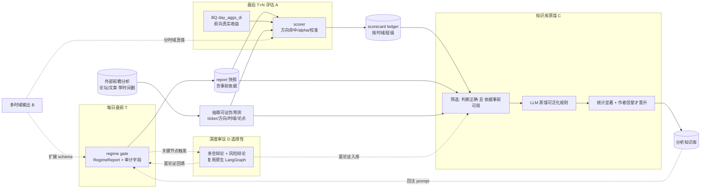

# 方向许可层 · 反馈闭环设计文档（评估 / 多时域 / 深度审议 / 知识库）

> 状态：**设计稿，尚未实现**。本文规划四块能力，把当前「只产出判断」的 regime gate 升级为「判断 → 验证 → 学习」的闭环。
> 范围：(A) 盘后准确性评估与监控；(B) 多时域（1/3/5 交易日）判断；(C) 事前可得、事后验证的分析知识库（含**外部前瞻分析引入**）；(D) 多智能体深度审议（复用原生辩论流水线，选择性接入）。
> 依赖：当前主流程见 `docs/regime-gate-main-flow.md`；概念图见 `docs/concept-graph-M2.md`；原生多智能体框架见 `tradingagents/agents/` + `tradingagents/graph/`。

---

## 0. 背景与动机

当前 regime gate 每个交易日盘前产出 `RegimeReport`（market_state + 多空白名单 + 每股方向/催化剂置信度 + 审计字段），落盘并上传 GCS。但存在四个缺口：

1. **无事后验证**：判断对不对，没有任何真值回看 → 无法量化准确率，也无法发现系统性偏差。
2. **单一时域**：只判断「近端」，缺少对 3/5 日的明确展望，下游无法按持有期分层。
3. **不积累经验**：每天独立判断，模型只用预训练知识，**正确的分析思路没有沉淀**，无法越用越准；且经验来源仅限自身，未利用外部高质量前瞻分析。
4. **决策深度不足**：关键节点（大盘、白名单决赛圈）只用单次结构化 LLM，缺少对抗式审议——而原生框架已有现成的多空辩论 + 风险辩论流水线**完全未被接入**。

依赖关系：**评估（A）产出对错标签 → 多时域（B）让评估按持有期细分 → 深度审议（D）在关键节点提升判断质量并产出富论证 → 知识库（C）用「正确且事前可得」的样本（含外部来源）蒸馏经验回注**。

> 关键资产：我们已落盘的**审计字段**（`macro_snapshot` / `key_drivers` / `economic_calendar`）天然记录了「当时盘前可得的真实依据」，这是 (C) 成立的前提（事前性已被保证）。

---

## 1. 总体反馈闭环



闭环：**判断（含多时域）→ 盘后评估打标签 → 蒸馏正确经验 → 回注下一次判断**。

---

## 2. 模块 A：盘后准确性评估与监控

### 2.1 目标
对每份历史 `RegimeReport`，在持有期结束后用真实收益打分，沉淀可追踪的准确率时间序列，并暴露系统性偏差（如长期看多偏置、置信度过度自信）。

### 2.2 真值来源
- **价格**：BQ `day_aggs_di`（已有）。个股取自身前向收益；大盘取 SPY/QQQ。
- **alpha**：个股收益 − 基准收益（复用原生 `default_config.benchmark_map` / `graph/trading_graph.py` 的 alpha 概念）。
- **前向窗口（开盘锚点，含当日）**：盘前判断后第一个可成交价是**会话日 D 的开盘**，故以 `open(D)` 为基准，持有 N 个交易日（**当日 D 记为第 1 天**），在 `close(i0+N-1)` 结算。例：2026-06-09 的判断，h1 = `open(06-09)→close(06-09)`（当日反应）、h3 → `close(06-11)`、h5 → `close(06-15)`。**严格用 cutoff 之后的真实成交**，不回看判断本身。
- **趋势判定用「路径」而非单一端点**：判断「这段时间整体涨/跌/横盘」时，单一端点收益不严谨（先涨后跌收平会被误判、阴跌末日反弹收高也会被误判）。故 `market_state` 用**对数价格在持有窗口上的 OLS 回归斜率（拟合漂移）+ R²** 来评：反转会让斜率塌向 0（正确判为横盘），稳定趋势保留斜率（Bullish/Bearish）；R² 区分「干净趋势」(→1) 与「来回震荡」(→0)。端点收益仍并列输出（那是买入持有的真实盈亏，驱动白名单经济性）。`trend_metric=slope`（默认）/`endpoint` 可切换。
- **波动率自适应阈值**：三态的「平带」用 `atr_k × proxyATR% × √N`（proxy 的 Wilder 日 ATR，仅取**盘前** bar，无前视），替代硬编 ±1%，随时域 √N 缩放；盘前历史不足时回退固定带。

### 2.3 评估指标（建议）
| 层级 | 指标 |
|---|---|
| 大盘 `market_state` | Bullish/Bearish/Range 对基准**路径趋势**（回归拟合漂移 + R²，非单一端点）的方向命中率，阈值用 ATR 自适应带；三态区分度（Bullish 平均收益 > Range > Bearish？） |
| 多头白名单 | 命中率（正收益占比）、平均 alpha、相对基准胜率 |
| 空头白名单 | 同上（方向取反） |
| 每股 `direction` | 精确率/召回；混淆矩阵（Long/Short/Block × 实际涨跌） |
| `catalyst_confidence` | **校准曲线**：分箱后「预测置信」vs「实际兑现率」是否对齐（可靠性图 + Brier 分数） |
| regime 否决 | 被 regime 规则否决的原始 Long（`regime_blocked_longs`，非覆盖）事后是否确实跑输（验证没误杀；统计「否决避免的损失」） |
| 概念/板块层 | sector/theme `direction` 对成员**路径趋势均值**（逐成员回归拟合漂移再聚合，同 `trend_metric` 口径，反转不再伪装成命中）的命中率 |

### 2.4 产物与契约（草案）
- 每份报告：`regime_gate_output/{session}/scorecard.json`
- 汇总：一张 BQ 表或 CSV ledger（每行 = session × horizon × 指标），便于看趋势/出报表。
- `scorecard.json` 草案字段：
```json
{
  "session": "2026-06-09",
  "evaluated_at": "2026-06-16",
  "horizons": {
    "h1": {"market_hit": true, "long_hit_rate": 0.61, "long_avg_alpha": 0.004,
            "short_hit_rate": 0.55, "dir_precision": {...}, "confidence_brier": 0.21},
    "h3": {...}, "h5": {...}
  },
  "circuit_breaker": {"blocked_longs": 197, "would_have_lost": 0.012}
}
```

### 2.5 触发与无未来函数
- 独立离线脚本 `scripts/evaluate_regime.py`（**无 LLM 成本**，纯 BQ + 读已落盘报告）。
- 每日盘后任务追加一步「评估 T−5 的报告」（5 日真值此时才齐）；也可一次性回填历史。
- 守则：评估只读「判断 cutoff 之后」的价格，不修改原报告，scorecard 单独落盘。

---

## 3. 模块 B：多时域（1/3/5 交易日）判断

### 3.1 目标
在大盘层（必要时个股层）输出对未来 1/3/5 交易日的分时域展望，使下游可按持有期分层，并让模块 A 能分时域评估。

### 3.2 方案（两档）
- **轻量（先做）**：扩展 `_L3Verdict` / `RegimeReport`，大盘层一次性输出 `outlook`：每个时域 `{direction, confidence, rationale}`；prompt 明确要求分别判断 1/3/5 日。个股层可加 `expected_horizon`（催化剂兑现窗口）。改动小、与 A 天然配套。
- **严谨（后续）**：每个时域作为独立预测目标，分别校准、分别设断路器阈值（短时域重事件/波动，长时域重趋势/基本面）。

### 3.3 Schema 草案
```python
class HorizonOutlook(BaseModel):
    horizon: str            # "1d" | "3d" | "5d"
    direction: Direction    # 或 MarketRegime
    confidence: float
    rationale: str

# RegimeReport 增加：
# outlook: list[HorizonOutlook] = []
```

### 3.4 取舍与守则
- 时域越长噪音越大、可预测性越低；断路器语义随时域变（隔夜 CPI 对 1 日是硬约束，对 5 日可能已消化）。
- **建议多时域只作展望输出，开仓白名单仍以近端为准**，避免长时域过度自信。
- 多时域同样受盘前 cutoff 约束（判断只用事前数据；真值评估才看事后）。

---

## 4. 模块 C：事前可得、事后验证的分析知识库

### 4.1 目标
把**被证明正确、且依据事前可得**的分析思路沉淀成可复用的知识，回注未来判断，使系统越用越准——而非每天从零依赖预训练。

### 4.2 双重准入门槛（核心约束）
一条分析思路可入库，当且仅当：
1. **(a) 事后正确**：由模块 A 的 scorecard 判定该判断在相应时域命中。
2. **(b) 事前可得**：其依据来自当时盘前可获取的数据。本系统已用「盘前 cutoff + 审计字段」保证——`macro_snapshot`/`key_drivers`/`economic_calendar` 记录的就是当时可得的真实依据。

> 这两条恰好对应 A 提供的「对错标签」与现有审计字段提供的「事前依据」，所以 C 在数据上已具备前提。

### 4.3 流程（复用原生 Reflector 思路，加双门槛 + 统计显著）
1. 模块 A 给每条历史判断打对错标签。
2. 对**正确**样本，跑「蒸馏」LLM：输入当时事前依据 + 实际结果，产出**可泛化规则**，例：
   > 「当 VIX 单日 +40% 但次日经济日历有 High-impact CPI 重新加速 → 倾向 Range 而非 Bearish。」
3. 规则进**候选库**，附统计（出现次数、命中率、平均 alpha）。
4. **晋升门槛**：只有被多次独立印证（达到最小样本量 + 命中率显著）才从候选晋升为「可用启发」。
5. **回注**：晋升规则注入未来 L3/L2 prompt。
   - 轻量：few-shot 启发条款（精选 N 条最相关规则拼进 prompt）。
   - 重量：向量检索 RAG（按当前盘前情形检索最相似的历史正确案例）。原生曾有 BM25 记忆（已删除），可按需重建为向量库。

### 4.4 知识条目 Schema 草案
```json
{
  "rule_id": "kb_0001",
  "pattern": "VIX 单日大涨 + 次日 High-impact CPI 上行预期",
  "ex_ante_evidence": ["macro_snapshot.vix_pct_change", "economic_calendar.CPI(High)"],
  "implication": "market_state 倾向 Range，不直接 Bearish",
  "support": {"instances": 6, "hit_rate": 0.83, "horizons": ["1d", "3d"]},
  "status": "promoted",        // candidate | promoted | retired
  "source_sessions": ["2026-06-09", "..."]
}
```

### 4.5 风险与守则
- **过拟合 / 幸存者偏差**：必须最小样本量 + 持续校准；命中率下滑的规则要能「退役」（status=retired）。
- **知识库只作软性指引**，不变成硬覆盖规则；保留每条规则可追溯的事前依据来源。
- **防数据泄漏**：蒸馏与回注都只用事前依据；真值仅用于打标签，绝不进入判断 prompt。
- **可解释**：每条入库规则必须能指向具体的事前字段与历史案例。

### 4.6 外部前瞻分析的引入（多源知识，不止自我反思）

**问题**：知识库不应只反思系统自身的判断。外部（大型论坛、分析文章、投研贴）常有人**事前**发布前瞻判断；若其预测事后被证明正确，且依据是事前可得的，其分析思路同样值得纳入。

**必要性与可能性**：**有必要、且可行**——它把候选思路的来源从「模型预训练 + 自身反思」扩展到「外部独立分析」，显著拓宽假设空间。但**只能作为「候选思路生成器」**，必须套用与 4.2 完全相同的双重门槛，再叠加额外防护，否则会学到幸存者偏差/噪音/操纵。

**数据来源**：原生框架已有 `dataflows/reddit.py`、`dataflows/stocktwits.py`（目前仅 Sentiment Analyst 用，有官方 API），可直接复用；后续可扩展 Seeking Alpha 等（注意 ToS/合规）。

**流程**：
1. **抽取可证伪预测**（LLM 解析自由文本）：`(ticker, 方向, 时域, 论点, 作者, 发布时间戳)`。无法形成可证伪预测的贴子丢弃。
2. **事前性校验**：以**发布时间戳**为 cutoff，只采信「在价格变动之前」发布的预测；编辑过/删除的贴子需谨慎（防回填篡改）。
3. **事后判定**：用模块 A 的真值（BQ 前向收益）判断该预测在其声明时域是否命中。
4. **入库门槛**（在 4.2 双门槛之上加码）：
   - **作者信誉**：维护每个来源/作者的历史命中率，低于阈值或样本不足者降权/过滤。
   - **统计显著**：同一思路需跨**多个独立作者/多次**印证，单条正确（可能是运气）不晋升。
   - **论点而非结论**：入库的是「可泛化的分析思路」，不是「买 X」的具体喊单。
5. 通过门槛后，与自我反思样本汇入**同一条** distill→promote→inject 管线（4.3）。

**风险与守则（专门针对外部源）**：
- **幸存者偏差 / 选择性记忆**：论坛事后只记得说对的人；必须以「发布即登记、到期统一结算」的方式记录**全部**预测（含说错的），否则命中率被高估。
- **操纵 / pump-and-dump**：可证伪预测 + 作者信誉 + 多源印证 + 只取思路不取喊单，多重对冲。
- **看未来函数**：严格以发布时间戳为界；爬取与结算分离。
- **合规**：优先用有官方 API 的来源（Reddit/StockTwits），遵守 ToS。

**外部知识条目 Schema 草案**（在 4.4 基础上加来源/作者维度）：
```json
{
  "rule_id": "kb_ext_0007",
  "origin": "external",
  "source": "reddit:r/...",
  "author_track_record": {"predictions": 38, "hit_rate": 0.66},
  "pattern": "财报前低 IV + 机构持仓上升 → 财报后跳涨",
  "ex_ante_evidence": ["post.published_at < move", "..."],
  "implication": "事件驱动型 Long 倾向",
  "support": {"independent_authors": 4, "instances": 11, "hit_rate": 0.73},
  "status": "candidate"
}
```

---

## 5. 模块 D：多智能体深度审议（选择性接入原生辩论流水线）

### 5.1 目标
当前关键决策只用单次结构化 LLM。原生框架已有现成的**对抗式审议**：多空研究员辩论 → Research Manager 裁决 → 三档风险辩论 → Portfolio Manager（`tradingagents/agents/` + `graph/`，见主流程文档与原生盘点）。把它作为**选择性深审层**接入，能在最重要的节点提升判断质量，并产出富论证供知识库使用。

### 5.2 接入点（按性价比，非全量）
| 节点 | 是否深审 | 理由 |
|---|---|---|
| **L3 大盘（指挥官）** | **总是** | 决策最重要、仅 1 次/天；多空+风险辩论天然贴合「战略指挥官+断路器」 |
| **L1 白名单决赛圈** | **选择性** | 仅对将进多/空白名单、或数值门与 LLM 冲突、或置信度临界的个股跑深审；控成本 |
| L1 普通个股 / L2 簇 | 否 | 安静即跳过原则不变；全量辩论成本过高 |

### 5.3 形态（两选一）
- **直接复用 `TradingAgentsGraph`**：对决赛圈个股按 `propagate(ticker, date)` 跑原生图，得到第二意见 + 富论证 + 5 档评级，与 regime 的 `StockSignal` 做交叉验证/融合。**注意原生图按单票运行**、且其工具走 yfinance/Alpha Vantage（与我们的 Massive/BQ 路径不同），需对齐数据口径与盘前 cutoff。
- **复用辩论「模式」重写 L3**：把 L3 指挥官从单次调用改为「看多研究员 vs 看空研究员 + 风险辩论 → 裁决」的结构化多步，喂入同样的 `macro_snapshot`/日历/板块 verdict。更可控、与现有时间语义一致（推荐先走这条）。

### 5.4 取舍与守则
- **成本**：辩论是多次 LLM 往返，必须严格限定触发面（L3 always + L1 决赛圈），并设辩论轮数上限（原生 `max_debate_rounds`）。
- **时间语义**：若直接用原生图，须确保其取数同样受盘前 cutoff 约束，避免引入未来函数。
- **产出复用**：辩论的多空论证是模块 C 蒸馏的优质素材（对抗式论证比单次结论更能暴露「事前依据→结论」的推理链）。

---

## 6. 与原生框架的复用关系

| 本设计模块 | 可复用的原生资产 | 说明 |
|---|---|---|
| A 评估 | `default_config.benchmark_map` + alpha 收益计算思路（`graph/trading_graph.py`） | 现成的 alpha vs benchmark 概念；regime 版独立实现，不耦合 memory log |
| **D 深度审议** | `agents/`（多空研究员 + Research Manager + 三档风险辩论 + PM）、`graph/setup.py`、`conditional_logic.py`、`max_debate_rounds` | 选择性接入；直接跑 `TradingAgentsGraph` 或复用辩论模式重写 L3 |
| C 知识库 | `graph/reflection.py` 的 Reflector 模式；`TradingMemoryLog`（决策日志/outcome 追踪） | 作为「蒸馏」步骤模板 + outcome 记录；加双门槛 + 统计显著 |
| C 外部源 | `dataflows/reddit.py`、`dataflows/stocktwits.py`（官方 API） | 外部前瞻分析的合规数据入口 |
| C 回注（RAG） | 已删除的 `FinancialSituationMemory`（BM25） | 如走 RAG 可重建为向量库 |
| 全部 | `llm_clients` 工厂、`market_tools`（BQ 真值/价格） | 沿用现有数据与 LLM 接入层 |

---

## 7. 实施顺序与里程碑

1. **F1 — 评估器最小版（A）✅ 已实现**：`regime/evaluate.py`（纯函数 `evaluate_report` + `Scorecard` schema）+ `scripts/evaluate_regime.py`（读已落盘报告 + BQ 日 OHLC → `scorecard.json`，可选上传 GCS）。**无 LLM 成本**。**开盘锚点、含当日**：基准=`open(D)`，h1=当日开→收、h3=`close(D+2)`、h5=`close(D+4)`；未到期的时域记 `null` 且 `complete=false`，可重跑。**波动率自适应带**：大盘三态判定用 `atr_k×proxyATR%×√N`（ATR 取盘前 bar，无前视）替代硬编 ±1%，按时域 √N 缩放、并落 `range_band_used`。指标：大盘三态命中、多/空白名单命中率/alpha/胜率、方向混淆矩阵与精确率、`catalyst_confidence` 的 Brier 校准、**regime 否决**事后收益（`regime_blocked_longs`，规则非覆盖）、概念/板块层命中率。测试见 `tests/test_regime_evaluate.py`。
2. **F2 — 多时域输出（B）✅ 已实现**：走「轻量档」——大盘层一次性输出 1/3/5 日展望。`schemas.py` 新增 `HorizonOutlook{horizon, direction(MarketRegime), confidence, rationale}` + `RegimeReport.outlook` 列表与 `outlook_for(days)` 查询；`l3_regime.py` 的 `_L3Verdict` 与 prompt 要求 LLM 分别判断 1/3/5 日（说明不同时域可背离，如隔夜 CPI 是 1 日硬约束但 5 日可能已消化）。**守则**：`market_state` 仍是近端锚点、驱动白名单与断路器；`outlook` 仅作展望，不参与白名单否决（避免长时域过度自信）。评估器 `evaluate.py` 同步按时域打分：每个时域用其**对应展望**评（`HorizonScore.graded_state` / `from_outlook` / `outlook_confidence`），无展望则回退 `market_state`（向后兼容）；沿用既有的路径斜率 + ATR 自适应带口径。测试见 `tests/test_regime_schemas.py`（展望解析/查询/roundtrip）、`tests/test_regime_l3.py`（展望透传、近端锚点不变）、`tests/test_regime_evaluate.py`（分时域独立打分、缺失回退）。
3. **F3 — 深度审议（D）**：先用辩论模式重写 L3 指挥官（可控、合时间语义）；再视效果对 L1 决赛圈选择性接入原生图。
4. **F4 — 知识库自反思（C 内部源）**：在 F1/F2/F3 产出的对错标签 + 事前依据（含辩论论证）之上做蒸馏、晋升、回注。先 few-shot，再视效果上 RAG。
5. **F5 — 知识库外部源（C 外部）**：接 Reddit/StockTwits 抽取可证伪预测 → 结算 → 作者信誉 + 多源印证 → 汇入同一蒸馏管线。
6. **F6 — 调度整合**：评估接入每日盘后任务（评估 T−5），外部预测「发布即登记、到期结算」，知识库定期重蒸馏。

---

## 8. 已知开放问题（待定）
- 大盘真值基准用 SPY 还是 QQQ（或两者都算）？前向收益用「收盘对收盘」还是「次开盘对收盘」？
- 多时域是否需要按时域单独设断路器阈值，还是统一近端门控？
- 知识库晋升的最小样本量 / 显著性阈值具体取值？外部源的作者信誉阈值？
- 回注用 few-shot 还是 RAG 作为长期形态？
- 深度审议（D）走「直接复用原生图」还是「复用辩论模式重写 L3」？原生图的数据口径如何与盘前 cutoff 对齐？
- 外部源优先接哪个平台（合规 + 数据质量），如何持久化「全部预测」以避免幸存者偏差？
