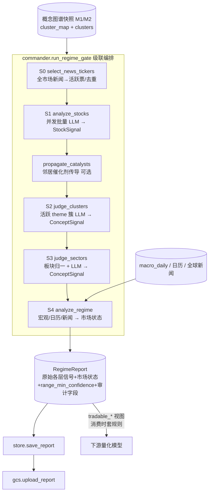

# 方向许可层（Regime Gate）主流程交付文档（供审阅）

> 范围：方向许可层的端到端主流程 —— 在概念图谱快照（M1/M2）之上，做**自底向上的四级 LLM 级联**（个股 → 主题簇 → 板块 → 大盘），输出带「物理断路器」的结构化 `RegimeReport`，并落盘 + 上传 GCS。
> 定位：系统的「战略指挥官」与「物理断路器」—— 剥离微观噪音，从宏观与基本面维度确认是否处于「顺风局」，并对个股/主题/板块给出方向许可（做多/做空/禁止白名单 + 催化剂置信度）。
> 状态：已实现并用真实全量数据跑通（610 票候选池、441/426 只活跃个股、44 簇、12 板块）；单测全绿。

---

## 1. 成果一览

| 能力 | 状态 | 证据 |
|---|---|---|
| S0 选股（有新闻的活跃票，份额类去重） | ✅ | 全市场新闻共现 → 候选池内活跃票，GOOGL→GOOG 合并 |
| S1 个股判别（并发批量 LLM） | ✅ | 新闻+基本面 → `StockSignal`（方向/催化剂置信度） |
| S2 主题簇判别（仅活跃簇） | ✅ | 成员信号 + 重抓簇级新闻 → theme `ConceptSignal` |
| S3 板块判别（板块归一） | ✅ | 主题级 verdict 汇聚 → sector `ConceptSignal`（11 板块） |
| S4 大盘判别 + 断路器 | ✅ | 宏观/日历/全球新闻 → `RegimeReport` + Long 拦截 |
| 盘前时间语义（无未来函数） | ✅ | 价格截上一交易日收盘；新闻截 09:00 ET |
| 瞬时故障重试（Massive/FMP/Gemini） | ✅ | 连接/5xx/429 指数退避+抖动，耗尽仍抛 |
| 审计字段（断路器可回溯） | ✅ | `macro_snapshot`/`key_drivers`/`economic_calendar` 落盘 |
| 本地 + GCS 持久化、可调度 | ✅ | `regime_gate_output/{session}/`、`gs://.../regime_gate/{session}/` |

---

## 2. 总体架构与数据流



**「安静即跳过」原则**：绝大多数个股在绝大多数交易日没有重要新闻（安静），故只对**活跃节点**调 LLM——有新闻的票（S1）、有活跃成员的簇（S2）、有活跃簇的板块（S3）。安静节点默认 Neutral，不产生 LLM 成本。

---

## 3. 模块清单 `tradingagents/regime/`

| 文件 | 职责 | 关键接口 |
|---|---|---|
| `commander.py` | S0→S4 线性编排 + 盘前 cutoff | `run_regime_gate(...)`、`premarket_cutoffs(session)` |
| `l1_stock.py` | S0 选股 + S1 个股判别（并发批量） | `select_news_tickers`、`analyze_stocks` |
| `l2_concept.py` | S2 簇判别 / S3 板块判别 + 数值门 | `judge_clusters`、`judge_sectors`、`aggregate_concepts`、`propagate_catalysts` |
| `l3_regime.py` | S4 大盘判别（不覆盖下层） | `analyze_regime` |
| `schemas.py` | 输出契约 | `StockSignal`、`ConceptSignal`、`RegimeReport`、枚举 |
| `tickers.py` | 份额类去重 | `canonical_ticker`、`canonicalize_tickers` |
| `store.py` / `gcs.py` | 报告本地/GCS 持久化 | `save_report`/`load_report`、`upload_report` |

---

## 4. 各级原理详解

### 4.1 S0 选股（`select_news_tickers`）

- 取 `(as_of - look_back, news_end]` 窗口的**全市场**新闻共现帧，统计候选池内每只票被提及频次，按频次排序。
- **份额类去重**：计数时把 `GOOGL→GOOG`、`BRK.A→BRK.B` 等并到 canonical（`tickers.canonical_ticker`），避免同一公司被双重分析与双重进白名单。
- 输出活跃票列表（`max_tickers` 可截断）。`commander` 也支持外部直接传 `news_tickers` 跳过 S0（小范围测试）。

### 4.2 S1 个股判别（`analyze_stocks`）

- 输入票先 `canonicalize_tickers` 去重；打包成 `batch_size`（默认 20）一批，批间用线程池（`max_workers`，默认 2）并发。
- 每票上下文 = 个股新闻（Massive，截 `news_end`）+ 基本面（`get_fundamentals`，默认 yfinance）。
- 结构化 LLM（Gemini Pro）按批产出 `StockSignal`（`direction` ∈ Long/Short/Block，`catalyst_confidence` ∈ [0,1]，`reason`）。
- 输出按输入顺序去重（first wins）。

### 4.3 催化剂传导（`propagate_catalysts`，可选）

强单票催化剂（Long/Short 且置信度 ≥ 0.6）沿概念图邻居（`get_neighbors`）衰减、封顶（`conf*weight*decay`，cap 0.3）地渗给**尚无信号**的邻居，让一只票的利好在逐簇判别前先抬升同概念同伴。

### 4.4 数值门 + S2 主题簇判别

- **数值门 `aggregate_concepts`**：把成员 `StockSignal` 按隶属权重上卷成每簇分数 `score = mean_conf * coherence`，决定 strength，并标记**活跃簇**（≥ `min_members` 个可行动成员）。安静簇默认 Neutral、不进 LLM。
- **S2 `judge_clusters`**：对**活跃** theme 簇并发调 LLM；上下文 = 成员信号 + 为 top-K 成员**重抓**的簇级新闻 → 产出 theme 级 `ConceptSignal`。

### 4.5 S3 板块判别（`judge_sectors`）

- 把 theme verdict 按 `parent_sector` 分组，分组前先过 `normalize_sector` 折叠到**标准 11 板块**（如 Semiconductor→Technology），消除板块碎片/重复计。
- 每个有活跃主题的板块并发调 LLM → 产出 sector 级 `ConceptSignal`；无活跃主题的板块缺席（下游视作 Neutral）。

### 4.6 S4 大盘判别（`l3_regime.py`，不覆盖下层）

- **输入**：`macro_daily` 结构化快照（`get_macro_summary`，真实利率/VIX/Nasdaq100/广义美元指数 + 陈旧度）、经济日历、全球新闻（FMP，截 `news_end`），以及最聚合层（板块 verdict，缺则簇 verdict）。
- 结构化 LLM 产出 `market_state`（Bullish/Range/Bearish）+ `macro_summary`（叙述）+ `key_drivers`。
- **断路器 = 消费时规则，不是覆盖**：核心原则是**上层绝不刷掉下层的原始判断**。L1 的 `StockSignal`、L2/L3 的 `ConceptSignal` 一律按各层真实判断保留（可审计、可供评估器/知识库使用）；regime 否决只在**消费时**通过 `RegimeReport` 的派生视图施加：
  - `tradable_long_whitelist`：Bearish ⇒ 否决全部 Long；Range ⇒ 否决 `catalyst_confidence < range_min_confidence`（默认 0.6）的 Long；Bullish ⇒ 不否决。
  - `regime_blocked_longs`：被规则否决的原始 Long（它们在 `stock_signals` 里**仍是 Long**）。
  - 空头不受此规则否决。`range_min_confidence` 落在报告里，规则可复现。
- **审计字段**：报告同时落盘真实 `macro_snapshot`、LLM `key_drivers`、`economic_calendar`，使「为什么看空/否决」可对照真实数字回溯（区分真实数据 vs LLM 叙述）。

### 4.7 输出契约 `RegimeReport`（`schemas.py`）

- `market_state`、`macro_summary`、`key_drivers`、`macro_snapshot`、`economic_calendar`、`range_min_confidence`（消费规则参数）。
- `stock_signals`（**原始** L1 方向）：
  - 原始视图 `long_whitelist`/`short_whitelist`/`block_list`（未经 regime 否决）。
  - 消费视图 `tradable_long_whitelist`/`tradable_short_whitelist`、`regime_blocked_longs`（套 regime 否决规则；**不改写** `stock_signals`）。
- `concept_signals`（theme + sector 两级原始判断，便于追溯；同样不被 regime 覆盖）。
- **一致性约束**：`ConceptSignal` 校验器强制 direction/strength 自洽——Block ⇒ strength=Neutral；Long/Short 不允许 Neutral（按 confidence 派生 Strong/Weak）。
- **不覆盖原则**：任何上层都不修改下层的原始判断；跨层否决一律以派生视图在消费时实现。

---

## 5. 盘前时间语义（无未来函数）

`commander.premarket_cutoffs(session)` 计算两种 cutoff：
- **价格 / 概念图**：用 `previous_trading_day(session)` 的收盘（上一交易日），由概念图快照保证。
- **个股 / 共现新闻**（Massive）：截 **session 当天 09:00 ET**（精确 RFC3339 `...Z` instant；09:00 而非 09:30，以纳入早盘 08:30 的宏观数据但不贴开盘）。
- **大盘新闻**（FMP）：截 session 当天 09:00 ET 墙钟；带时间戳的过滤、当天纯日期项在回滚时丢弃（backfill 安全）。
- **macro_daily**：取 `trade_date = session` 的行（管道已 `shift(1)` 对齐为上一交易日收盘，盘前可见，无前视）。

`--as-of latest` 在盘前解析为今天 ET：此时当天 bar 尚不存在，数据天然截止上一交易日，部署后无未来函数。

---

## 6. 健壮性：瞬时故障重试

每日全量要发起数百次外部请求，偶发 TLS 断流/限流不可避免。统一加固（**只重试瞬时故障，耗尽仍抛、4xx/schema 立即抛 —— 不掩盖真实错误**）：

| 请求点 | 重试位置 | 覆盖异常 |
|---|---|---|
| Massive / FMP / Alpha Vantage | `dataflows/_http.get_with_retry`（调用方传入 `requests.get`） | SSLError、ConnectionError、Timeout、ChunkedEncodingError、429/5xx |
| Gemini（L1/L2/L3 结构化调用） | `NormalizedChatGoogleGenerativeAI.invoke` | httpx RemoteProtocolError/Connect/Read/Write/Pool、genai ServerError |

退避：指数 `1→2→4…` 封顶 30s + ≤25% 随机抖动；尊重 `Retry-After`。默认并发 `max_workers=2` 降低瞬时压力。

---

## 7. 持久化与调度

- **本地**：`regime_gate_output/{session}/regime_report.json`（`store.save_report`）。
- **GCS**：`upload_report(session, bucket, prefix="regime_gate")` → `gs://{bucket}/regime_gate/{session}/regime_report.json`。
- **每日盘前**（`scripts/run_regime_gate_daily.sh`）：ET 工作日门控 → 先 `rebuild_concept_graph.py --as-of latest --all --name`（上传 `concept_graph/`）→ 再 `run_regime_gate.py --as-of latest`（上传 `regime_gate/`）。用 launchd/cron 在盘前触发（如北京 20:00）。

---

## 8. 测试与实测证据

**单元测试（mock 工具 + schema-aware fake LLM）**：
- `test_regime_l1/l2/l3.py`、`test_regime_cascade.py`：选股/批量/顺序去重、数值门/传导、簇/板块判别、端到端级联、`premarket_cutoffs` 的 09:00 ET→UTC 换算、断路器。
- `test_regime_schemas.py`：白名单派生、置信度边界、**ConceptSignal 一致性约束**。
- `test_sectors_tickers.py`：板块归一、份额类去重。
- `test_fmp_premarket_filter.py`：FMP 盘前 cutoff 的 backfill 安全。
- `test_regime_store.py`：报告读写 roundtrip（含 Unicode）。

**真实数据跑通（6/9 盘前模拟）**：
- 修正宏观数据前：`Bearish`，Long 白名单 0（VIX 错位/填充导致 21.5 落到会话行）。
- 修正后重跑：`Range`，Long 白名单 75（高确信多头放行）；审计字段证实 CPI「3.8%→4.2%」来自真实经济日历（次日 High impact 印数），非 LLM 幻觉。

---

## 9. 已知边界与后续

- **L1 与 L2/L3 方向可并存背离**（特性而非 bug）：板块看多时个别龙头仍可做空；下游量化消费需明确同板块多空并存的处理。
- **基本面默认 yfinance**：其 HTTP 在库内部，不经统一重试层；如需更强一致性可切 Alpha Vantage（已纳入重试）。
- **跨日簇 id 不稳定**（见 M2）：影响主题级时间序列追踪。
- **份额类映射表**为人工维护（`tickers.SHARE_CLASS_CANONICAL`），新增对需补充。

---

## 10. 用法

```python
from tradingagents.dataflows.secrets import load_secrets_to_env
from tradingagents.regime import run_regime_gate

load_secrets_to_env()
report = run_regime_gate("2026-06-09")          # 交易会话日（盘前）
print(report.market_state, report.long_whitelist)
```

命令行：

```bash
# 全量盘前 + 上传 GCS
python scripts/run_regime_gate.py --as-of latest --gcs-bucket trading_agent

# 小范围验证（跳过 S0 全市场扫描，单线程，数值门）
python scripts/run_regime_gate.py --as-of 2026-06-09 \
    --news-tickers NVDA,AMD --max-workers 1 --no-llm-concepts
```
